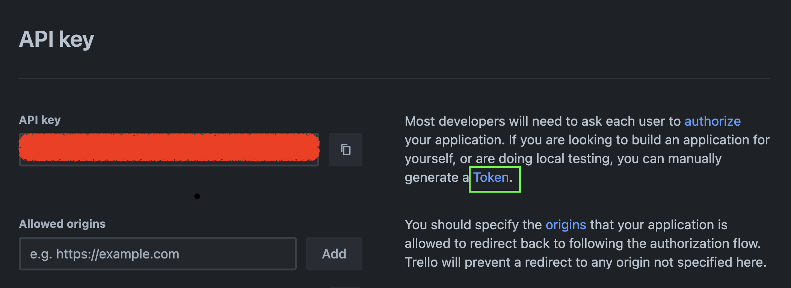

# Trello Board CSV Exporter

This script allows you to export data from a Trello board to a CSV file.

## Prerequisites

Before you can run the script, you need to make sure the required Python dependencies are installed in your environment, [see requirements.txt](/requirements.txt).

1. **Trello API Key and Token**: You can obtain your Trello API key and access token by following these steps:

   a. Visit [Trello Developer Page](https://trello.com/power-ups/admin/) select/create 'Power-Up', retrieve your API key.

   b. To get a secret access token, press this to Authorize your application, and you will receive an access token:

   

2. **Environment Variables**: Create a `.env` file in your project directory (if not already present) and add your Trello API Key and Token in the following format:
   ```bash
   TRELLO_API_KEY=your_api_key
   TRELLO_TOKEN=your_access_token
   ```

## Usage

1. Run the script.

   ```bash
   python -m trello_exporter
   ```

2. Follow the script's prompts to select the Trello board you want to export.

3. The script will generate an Excel file with the exported data in the ./csv directory.
